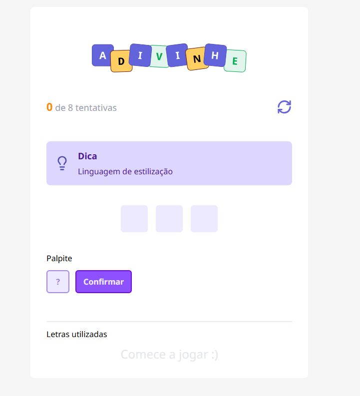

# Adivinhe - Jogo de Palavras

Um jogo interativo de adivinhação de palavras desenvolvido com **React + Vite**, estilizado com **TailwindCSS** e **CVA (Class Variance Authority)**, e escrito em **TypeScript**.

## ✨ Sobre o Projeto

"Adivinhe" é um jogo simples e divertido de adivinhar palavras com base em uma dica exibida na tela. O jogador tem um número limitado de tentativas para acertar a palavra correta.

### 🔍 Funcionalidades

- ✅ Sistema de dicas para guiar o jogador
- 🔢 Contador de tentativas
- ⌨️ Campo para inserir letras e confirmar palpites
- 🟪 Interface intuitiva e leve
- 🔁 Botão para reiniciar o jogo

---

## 🛠️ Tecnologias Utilizadas

- [React](https://react.dev/)
- [Vite](https://vitejs.dev/)
- [TailwindCSS](https://tailwindcss.com/)
- [Class Variance Authority (CVA)](https://cva.style/)
- [TypeScript](https://www.typescriptlang.org/)
